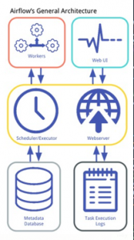

# Escenario de la Practica
El Github con el enunciado de la práctica se puede encontrar en el siguiente repositorio:
https://github.com/ging/practica_big_data_2019

## Instalación de componentes
Clonar el proyecto de github, colocarse en su interior y ejecutar la instalación
```
git clone https://github.com/hugopascual/BDFI_practica_final_agile
cd BDFI_practica_final_agile
sudo sh scripts/installations.sh
```
----------------------
## Inicio del escenario con scripts

Para instalar y ejecutar la práctica, se pueden utilizar los scripts añadidos a dicha carpeta, donde ahora veremos la 
funcionalidad de cada uno de ellos:

### 1.- Installations.sh

Realiza la instalación de todos los componentes necesarios para realizar la práctica, con las versiones definidas en el
apartado instalación con los correspondientes comandos mencionados. Si no se ha realizado la instalación de las 
aplicaciones mencionadas, no se puede inicializar la práctica.

### 2.- Environment.sh

Realiza la configuración de variables de entorno necesarias en el repositorio. Realiza la exportación de todas ellas
para un funcionamiento correcto en todos los terminales necesarios y especifica los pasos necesarios para ejecutar 
la práctica. En todos los terminales que se utilicen en la práctica, se tiene que ejecutar previamente este script. 

La ejecución de este script debe ser mediante source:

```
source scripts/enviroment.sh
```

### 3.- Start-primal-services.sh

Con dicho script comenzamos con la descarga de datos de la práctica, rellenando los datos de vuelos de diferentes años
para disponer de la información para nuestra base de datos.
Posteriormente, el comando corre los scripts de Zookeper y Kafka para arrancarlos, y crea el topic 
'flight_delay_classification_request' en Kafka.

Inicializa la base de datos en MongoDB e importa en ella las distancias.
Posteriormente, realiza el entrenamiento del modelo a través de PySpark mllib y almacena el modelo en la base de datos.

Tras esto crea un usuario airflow con el nombre de uno de los alumnos que realizaron la práctica y una contraseña 
e inicializa la base de datos básica de airflow. Finalmente, instala el DAG de datos necesarios para el uso de 
Apache Airflow.

### 4.- Spark-app.sh

Arranca la aplicación de predicción de vuelos 'Flight Predicator' a través de spark submit y 
con los datos almacenados en mongo. Requiere que estén instalados todos los componentes para un 
correcto funcionamiento del comando. Se utiliza spark-submit y no IntellIJ para realizar las predicciones 
y lanzar la aplicación. (Mejora 1).

### 5.- Flask.sh

Arranca la aplicación de flask para visualizar la predicción de nuevos vuelos introducidos por el usuario. 
Se puede observar a través del puerto 5000 de localhost en un navegador.

### 6.- Airflow-web.sh 

Arranca Airflow para tener acceso desde el puerto 3000 de localhost.

### 7.- Airflow-scheduler.sh

Arranca Airflow Scheduler para su uso.

### 8.- Stop-primal-services.sh

Este comando pone fin a la práctica y sirve para parar todos los recursos lanzados en el terminal con 
start-primal-services.sh. Pausa y elimina los procesos de Kafka, Mongo y Zookeper.

### 9.- Clean.sh

Limpia los archivos creados por los diferentes programas como son Zookeeper, Kafka, la base de datos de MongodB y 
similares para poder arrancar el escenario desde 0.

# Inicio manual del escenario
## Instalación y descarga de componentes necesarios
Tras la instalación de los programas necesarios mediante installations.sh si se desea arrancar el escenario de forma 
manual se deben seguir los siguientes pasos.

Instalar librerías de python
```
pip install -r requirements.txt
```
Descarga de datos utilizados para el entrenamiento del modelo de predicción
```
resources/download_data.sh
```

## Arrancar Zookeeper y Kafka


Arrancar Zookeeper
```
apache-zookeep-3.7.1-bin/bin/zkServer.sh start apache-zookeeper-3.7.1-bin/conf/zoo_sample.cfg
``` 
Zookeeper se puede parar con
```
apache-zookeeper-3.7.1-bin/bin/zkServer.sh stop apache-zookeeper-3.7.1-bin/conf/zoo_sample.cfg
```
Arrancar Kafka
```
kafka_2.12-3.1.2/bin/kafka-server-start.sh kafka_2.12-3.1.2/config/server.properties
```
Crear un nuevo topic en otra terminal
```
kafka_2.12-3.1.2/bin/kafka-topics.sh --create --bootstrap-server localhost:9092 --replication-factor 1 --partitions 1 --topic flight_delay_classification_request
```
Debería salir un mensaje como:
```
Created topic "flight_delay_classification_request".
```
Se puede consultar la lista de topics con:
```
kafka_2.12-3.1.2/bin/kafka-topics.sh --bootstrap-server localhost:9092 --list
```
Se puede abrir una consola con un consumidor para ver los mensajes que llegan al topic
```
kafka_2.12-3.1.2/bin/kafka-console-consumer.sh --bootstrap-server localhost:9092 --topic flight_delay_classification_request --from-beginning
```

## Importar datos a MongoDB

Arrancar Mongo y comprobar que está en funcionamiento
```
sudo systemctl start mongod
sudo systemctl status mongod

Run import_distances.sh
```
Ojo, aquí se sufre una modificación debido al uso de un comando obsoleto, por ello se utiliza la llamada mongosh en 
vez de mongo dentro de import_distances.sh. Si se ha clonado este repositorio y no el padre está corregido.

## Entrenar y guardar el modelo con PySpark mllib

Primero establecemos JAVA_HOME
```
export JAVA_HOME=/usr/lib/jvm/java-1.8.0-openjdk-amd64
```
Como ejecutar el script 
```
python3 resources/train_spark_mllib_model.py .
```
Los resultados deberían estar guardados en /models
```
ls /models
```
## Arrancar la aplicación Flight Predicator

Se puede hacer a traves de IntellIJ arrancado el main de MakePrediction

Otra forma es compilar con sbt el MakePrediction.scala y arrancarlo con spark-submit
Para compilar el proyecto, abrir un terminal en el directorio donde se encuentra el src del proyecto
Ejecutar sbt y en la shell de sbt ejecutar el compile.
```
sbt
# En la bash abierta por el anterior comando
compile
# El resultado de la compilación debería resultar en
practica_big_data_2019/flight_prediction/target/scala-2.12/classes ...
# Tras la compilación creamos el .jar utilizando el siguiente comando en la bash de sbt
package
# El resultado de la compilación estará en target/scala-2.12/
```
```
# Una vez tengamos el .jar para lanzar el servicio utilizamos
spark-submit --packages org.mongodb.spark:mongo-spark-connector_2.12:3.0.1,org.apache.spark:spark-sql-kafka-0-10_2.12:3.1.2 flight_prediction/target/scala-2.12/flight_prediction_2.12-0.1.jar
```

## Start the prediction request Web Application

Crear la variable de entorno al repositorio clonado 
```
export PROJECT_HOME=/home/hugo/Documentos/BDFI/BDFI_practica_final_agile
```
Arrancar la aplicación de flask 
```
python3 resources/web/predict_flask.py
# !!!! Libreía de python, "joblib" no encontrada, hay que comentarla en el repositorio original
# Una vez arrancada se debe poder visitar la dirección
# http://localhost:5000/flights/delays/predict_kafka
```
Para comprobar el funcionamiento adecuado se puede seguir las siguientes instrucciones:

"open the JavaScript console. Enter a nonzero departure delay, an ISO-formatted date (I used 2016-12-25, 
which was in the future at the time I was writing this), a valid carrier code (use AA or DL if you don’t know one), 
an origin and destination (my favorite is ATL → SFO), and a valid flight number (e.g., 1519), and hit Submit. 
Watch the debug output in the JavaScript console as the client polls for data from the response endpoint at 
/flights/delays/predict/classify_realtime/response/."

Al hacer esto en la consola donde esté ejecutando el Spark deberían aparecer trazas nuevas.

## Check the predictions records inserted in MongoDB

Para comprobar que los resultados se almacenan adecuadamente en MongoDB podemos ejecutar en la shell de MongoDB:
```
# !!!! El comando especificado en el repo oficial es incorrecto, hay que quitar el segundo 'use'
use agile_data_science;
db.flight_delay_classification_response.find();
```

#TODO: add the DAG and execute it to train the model (see the official documentation of Apache Airflow to learn how to 
exectue and add a DAG with the airflow command).

## Entrenar el modelo con Apache Airflow

Apache Airflow 2.1.4 se instala con pip. Se usará SQLite para probar en esta práctica aunque no es recomendable 
para producción. Para instalar las librerías de Apache Airflow:
```
pip install -r resources/airflow/requirements.txt
```
Para configurar el entorno de Apache Airflow:
```
export AIRFLOW_HOME=$PROJECT_HOME/airflow
mkdir $AIRFLOW_HOME/dags
mkdir $AIRFLOW_HOME/logs
mkdir $AIRFLOW_HOME/plugins

airflow users create --username hugo --password 1234 --firstname hugo --lastname pascual --role Admin --email hugopascual998@gmail.com
```
Arrancar airflow scheduler y webserver:
```
airflow webserver --port 3000
airflow scheduler

# Versión web en la siguiente dirección:
# http://localhost:3000/home
```

The DAG is defined in resources/airflow/setup.py.

#TODO: explain the architecture of apache airflow (see the official documentation of Apache Airflow).

##Airflow´s General Architecture

La siguiente imagen resume como es la arquitectura de Apache Airflow, la cual está también diseñada usando únicamente Python.

[]

Una base de datos de metadatos contiene toda la información de los workflows, sus estados y sus dependencias. Esto está conectado con el scheduler, un proceso que en función de los datos de la base de datos, determina el orden en el que se ejecutara cada tarea y su prioridad. Muy ligado a éste tenemos el executor, que es un proceso de mensajería de colas que determinará que nodo ejecutará cada tarea. Es decir, el scheduler determina el orden de las tareas y el executor quién ejecutara cada una. Y por último tenemos los workers, procesos que ejecutan la lógica de una tarea.

Luego por otro lado tenemos un servidor web que utiliza la información de la base de datos y los logs generados por los workers para reflejar toda esta información en su interfaz web.

Uno de los elementos que más va a influir en el rendimiento de un DAG es el executor. Hay multitud de tipos, a continuación de resumen los 4 más utilizados:

###SequentialExecutor:

Es el más sencillo, ejecuta las tareas en serie y en local.

###LocalExecutor:

Muy parecido al anterior, también se ejecuta en local, pero éste permite paralelización.

###CeleryExecutor:

Permite la ejecución de tareas distribuidas utilizando Celery, un módulo de Python utilizado para la gestión de tareas asíncronas y distribuidas. Para este executor ya es necesario una configuración extra, se necesita un sistema de mensajería de colas y, además, tener cada uno de los nodos distribuidos configurado de manera que se puedan ejecutar correctamente las tareas pertinentes.

###KubernetesExecutor:

Permite la ejecución de tareas haciendo uso de pods de Kubernetes. En este caso el executor interacciona con la API de Kubernetes, y es esta la que se encarga de desplegar un pod para cada una de las tareas, con las características necesarias, y una vez acabado lo destruye e informa al executor del estado final de la tarea.

#TODO: analyzing the setup.py: what happens if the task fails?, what is the peridocity of the task?

En caso de que falle el arranque, tendríamos un error en la actualización continua del modelo de predicción, donde no se actualizaría el entrenamiento con los nuevos datos introducidos en la base de datos. Tiene un delay definido de 5 minutos, como se especifica en setup.py

### Para ejecutar el DAG desde el terminal
```
airflow tasks test agile_data_science_batch_prediction_model_training pyspark_train_classifier_model 2022-11-22
```

# Despliegue del escenario usando Docker y Docker Compose
Por último, se puede observar los avances y comandos a ejecutar para realizar el despliegue en docker. Por falta de 
tiempo únicamente se ha podido probar el funcionamiento de algunos contenedores y ajustarlos al uso deseado. Debido a 
los problemas encontrados, no se ha podido realizar un despliegue entero en docker. 

Los avances se puede encontrar en el docker-compose y en cada uno de los contenedores establecidos. Todos los 
archivos referidos a esta construcción se encuentran en el directorio "docker".

Para arrancar el escenario ejecutar el siguiente comando desde el directorio "docker" donde se encuentra el fichero 
docker-compose.yml.
```
sudo docker-compose up -d
```
Esto levantará un contenedor de Zookeeper y Kafka que operan conjuntamente. Tras ello levantará dos contenedores uno de
ellos con MongoDB y otro con Mongo Express. Este último es accesible a traves de http://127.0.0.1:8081/ . Una vez 
desplegados los contenedores de MongoDB arranca un cluster de Spark con 1 master y un worker. El master de Spark 
habilita una interfaz web a traves de http://127.0.0.1:8080/ . Para poder realizar las peticiones por parte del cliente
se despliega un contenedor con el servidor Flask en la dirección http://127.0.0.1:5000/flights/delays/predict_kafka .

También se despliega un contenedor con Airflow aunque este no es funcional. Además, en los contenedores de Spark no 
se ha conseguido instalar las dependencias de python con pip por lo que no son funcionales, ya que no se puede ejecutar 
el entrenamiento del modelo de predicción.

Para comprobar que el despliegue ha ido correctamente se pue utilizar
```
sudo docker-compose ps
```

Para poder ejecutar comandos en cualquiera de las máquinas docker
```
sudo docker exec -it <nombre_del_contenedor> /bin/bash
```

Este comando parará el despliegue y borrará los volúmenes locales que ha creado el despliegue.
```
sudo docker-compose down && sudo docker volume prune -f
```

Si se quiere borrar las imágenes descargadas y limpiar la máquina de los restos de docker se puede usar lo siguiente:
```
sudo docker system prune -fa
```

Además, en se incluyen dos scripts "restart.sh" y "stop.sh" que son reinician el escenario o lo detienen para facilitar 
la tarea y no tener que escribir los comandos.


